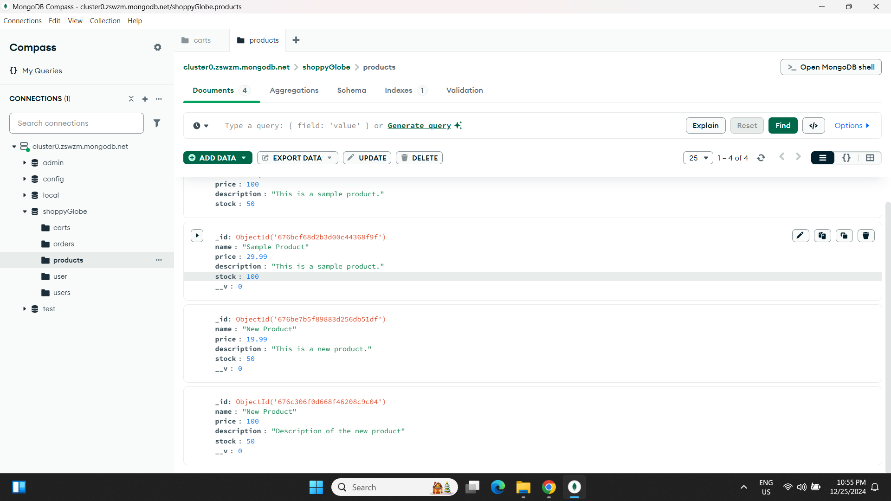

## A. User Registration

## B. User Login

## C. Get All Products

## D. Get Product by ID

## E. Create a New Product (Admin Only)

## F. Update a Product (Admin Only)

## G. Delete a Product (Admin Only)

## H. Add to Cart

## I. View Cart

## J. Update Cart Item

## K. Remove Item from Cart

## L. Checkout (Create Order)

### PRODUCT COLLECTION

### CART COLLECTION

### Testing Error Handling 
## 1. Test Case: Add Product to Cart with Invalid Product ID

## 2. Test Case: Update Cart with Invalid Data

## 3. Error Response for Cart Route Without Token

